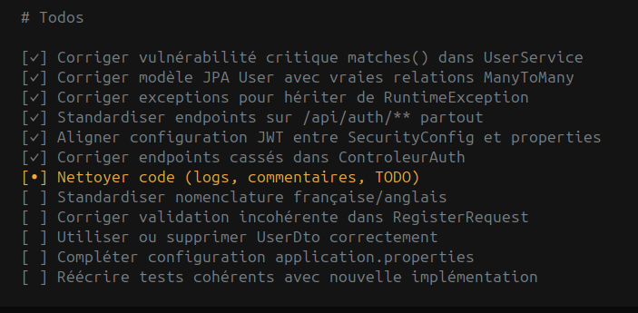

# 🚨 Analyse Critique et Sévère du Module d'Authentification

## **PROBLÈMES CRITIQUES** (Urgence absolue)

### 1. **🔴 VULNÉRABILITÉ SÉCURITÉ CRITIQUE - Inversion des paramètres de vérification**
**Fichier**: `UserService.java:30`
```java
if (passwordEncoder.matches(user.getPassword(), password)) {
```
**Problème**: Paramètres inversés ! `matches(encodedPassword, rawPassword)` est attendu. Le code ne fonctionnera jamais et pourrait créer des vulnérabilités.
**Correction**: `if (passwordEncoder.matches(password, user.getPassword()))`

### 2. **🔴 INCOHÉRENCE TOTALE DES ENDPOINTS - Chaos architectural**
**Problème**: Trois standards différents dans le même projet :
- Controller: `/auth/**`
- Security: `/api/**` 
- Tests: `/api/auth/**`

**Impact**: Aucun endpoint ne fonctionnera correctement en production.

### 3. **🔴 CONFIGURATION JWT INCONSISTANTE**
**Fichiers**: `SecurityConfig.java:48` vs `application.properties:5`
- Code: `expiration-minutes:60` (1h)
- Properties: `expiration-minutes:15` (15min)

**Impact**: Comportement imprévisible des tokens.

## **PROBLÈMES MAJEURS** (Fonctionnement compromis)

### 4. **🟠 MODÈLE JPA INCOMPLÈT ET INCORRECT**
**Fichier**: `User.java`
```java
@Table(schema = "USER")  // Schema en majuscules non standard
private List<Role> role; // Pas d'annotations JPA !
```
**Problèmes**: 
- Relation `@ManyToMany` non définie
- `Role` est un enum, pas une entité
- Schema non conventionnel

### 5. **🟠 NOMENCLATURE CHAOTIQUE - Français/Anglais mixte**
- `ControleurAuth` (français) vs `UserService` (anglais)
- `inscrire()` (français) vs `getProfile()` (anglais)
- `UserInexistantException` (français) vs `PasswordIncorrectException` (mixte)

### 6. **🟠 EXCEPTIONS HÉRITANT DE THROWABLE**
**Fichier**: `UserInexistantException.java:3`
```java
public class UserInexistantException extends Throwable {
```
**Problème**: Anti-pattern Java. Doit hériter de `Exception` ou `RuntimeException`.

### 7. **🟠 ENDPOINTS NON FONCTIONNELS**
**Fichier**: `ControleurAuth.java:80`
```java
return ResponseEntity.ok(this.userService.updateUser()); // Paramètres manquants !
```
**Problème**: Méthode `updateUser()` attend un `User` mais n'en reçoit aucun.

## **PROBLÈMES MINEURS** (Qualité et maintenabilité)

### 8. **🟡 CODE SALE ET NON MAINTENU**
- Fautes d'orthographe: "connecter" au lieu de "connecté"
- TODO non résolus depuis des mois
- Commentaires inutiles en français

### 9. **🟡 TESTS TOTALEMENT DÉSACTIVÉS**
**Fichier**: `AuthentificationApplicationTests.java`
Tous les tests sont commentés avec `// @Test` - aucune couverture de test.

### 10. **🟡 DTO INUTILISÉ**
`UserDto.java` existe mais n'est jamais utilisé dans les controllers.

### 11. **🟡 VALIDATION INCOHÉRENTE**
**Fichier**: `ControleurAuth.java:109`
```java
@NotNull String roles // Devrait être List<Role> ou Set<Role>
```

### 12. **🟡 LOGS CONTRE-PRODUCTIFS**
```java
logger.info("Nouveau user connecter : {}", user.getMail()); // Faute d'orthographe
```

## **🎯 PLAN DE CORRECTION PRIORITAIRE**

### **Phase 1 (Sécurité - 24h)**
1. Corriger la vulnérabilité `matches()` 
2. Standardiser tous les endpoints sur `/api/auth/**`
3. Aligner la configuration JWT

### **Phase 2 (Fonctionnement - 48h)**
4. Refactoriser le modèle JPA avec des vraies relations
5. Standardiser la nomenclature (choisir français métier/anglais technique)
6. Corriger les exceptions et les endpoints cassés

### **Phase 3 (Qualité - 1 semaine)**
7. Nettoyer le code (logs, commentaires, TODO)
8. Réactiver et corriger les tests
9. Implémenter une vraie couche DTO
10. Ajouter la validation cohérente

## **📊 ÉVALUATION GLOBALE**

**Note**: 2/10
- **Sécurité**: 1/10 (vulnérabilités critiques)
- **Fonctionnement**: 3/10 (endpoints cassés)
- **Qualité**: 2/10 (code sale, pas de tests)
- **Maintenabilité**: 2/10 (incohérences partout)

## **🔥 RECOMMANDATIONS FORTES**

1. **ARRÊTER IMMÉDIATEMENT** tout développement de nouvelles fonctionnalités
2. **REFONDRE COMPLÈTEMENT** le module avant toute mise en production
3. **AJOUTER DES REVUES DE CODE** obligatoires pour chaque commit
4. **IMPLÉMENTER DES TESTS AUTOMATISÉS** avec CI/CD
5. **DOCUMENTER L'API** avec OpenAPI/Swagger

## **📝 DÉTAILS DES PROBLÈMES PAR FICHIER**

### `UserService.java`
- **Ligne 30**: Vulnérabilité critique dans `matches()`
- **Lignes 70-71**: `orElseThrow()` sans exception personnalisée
- **Lignes 64-66**: `getUser()` avec `orElseThrow()` incorrect

### `ControleurAuth.java`
- **Ligne 23**: `@RequestMapping("/auth")` incohérent avec `/api/**`
- **Lignes 42, 55**: Fautes d'orthographe dans les logs
- **Ligne 80**: `updateUser()` appelé sans paramètres
- **Lignes 86, 89**: `changePassword()` avec `@RequestAttribute` incorrect
- **Lignes 79, 88**: TODO non implémentés

### `SecurityConfig.java`
- **Ligne 48**: `expiration-minutes:60` incohérent avec properties
- **Lignes 84-87**: Endpoints `/api/**` mais controller utilise `/auth/**`
- **Ligne 53**: Log inutile

### `User.java`
- **Ligne 13**: `@Table(schema = "USER")` non standard
- **Ligne 29**: `List<Role> role` sans annotations JPA
- **Lignes 31-35**: Constructeur incomplet (pas d'initialisation des rôles)

### `application.properties`
- **Ligne 5**: `expiration-minutes:15` incohérent avec SecurityConfig
- **Manque**: Configuration H2, logging, chemins des clés JWT

### `test-api.http`
- **Lignes 2, 18, 35, 45, 61, 72, 82, 92, 101**: Utilise `/api/auth/**` mais controller est `/auth/**`
- **Lignes 18, 35**: Endpoints `/api/auth/utilisateurs` non définis dans le controller

## **🛠️ CORRECTIONS CODE EXACTES**

### Correction 1 - Vulnérabilité sécurité
```java
// AVANT (UserService.java:30)
if (passwordEncoder.matches(user.getPassword(), password)) {

// APRÈS
if (passwordEncoder.matches(password, user.getPassword())) {
```

### Correction 2 - Standardisation endpoints
```java
// AVANT (ControleurAuth.java:23)
@RequestMapping("/auth")

// APRÈS
@RequestMapping("/api/auth")
```

### Correction 3 - Configuration JWT
```java
// AVANT (SecurityConfig.java:48)
@Value("${security.jwt.expiration-minutes:60}")

// APRÈS
@Value("${security.jwt.expiration-minutes:15}")
```

### Correction 4 - Exceptions correctes
```java
// AVANT (UserInexistantException.java:3)
public class UserInexistantException extends Throwable {

// APRÈS
public class UserInexistantException extends RuntimeException {
```

### Correction 5 - Modèle JPA correct
```java
// AVANT (User.java:13, 29)
@Table(schema = "USER")
private List<Role> role;

// APRÈS
@Table(name = "users")
@ManyToMany(fetch = FetchType.EAGER)
@JoinTable(
    name = "user_roles",
    joinColumns = @JoinColumn(name = "user_id"),
    inverseJoinColumns = @JoinColumn(name = "role_id")
)
private Set<Role> roles = new HashSet<>();
```

## **⚠️ AVERTISSEMENT FINAL**

Ce module n'est **PAS PRÊT POUR LA PRODUCTION** et présente des **RISQUES SÉCURITAIRES MAJEURS**. Une refonte complète est recommandée avant tout déploiement. Les problèmes identifiés doivent être traités dans l'ordre de priorité indiqué pour éviter des failles de sécurité critiques.

**Date de l'analyse**: 21/01/2026  
**Analyse effectuée par**: OpenCode AI Agent  
**Statut**: CRITIQUE - Intervention immédiate requise


